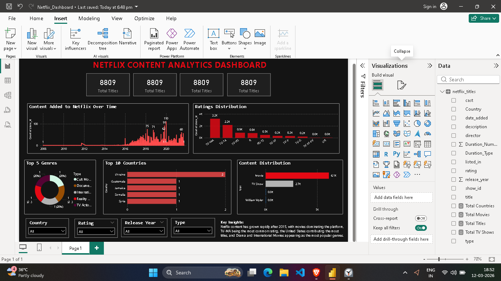

# Netflix Content Analytics Dashboard (Power BI)

## Project Overview

This project analyzes Netflix's content catalog using Power BI to uncover trends in content growth, genre distribution, ratings, and country contributions.

## Tools Used

* Power BI
* Power Query (Data Cleaning)
* Excel / CSV Dataset

## Dashboard Features

* Content distribution (Movies vs TV Shows)
* Content added over time
* Top genres on Netflix
* Top countries producing Netflix content
* Ratings distribution

## Key Insights

Netflix content has grown rapidly after 2015, movies dominate the platform, TV-MA is the most common rating, the United States contributes the most titles, and Drama and International Movies are among the most popular genres.

## Dataset

Netflix Titles Dataset

## Dashboard Preview

